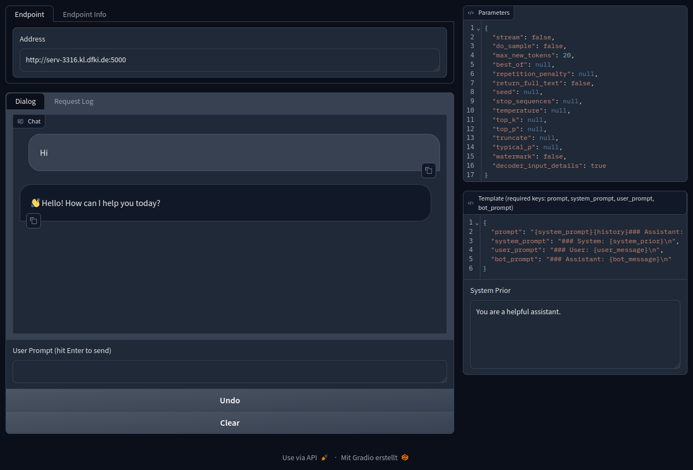

# A Simple, but Flexible Frontend for Text-Generation-Inference

## Setup
1. Install requirements: `pip install -r requirements.txt`
2. Start the frontend: `python app.py`
3. Start a backend with any of the [scripts](https://github.com/DFKI-NLP/perseus-textgen/tree/master/scripts), get the API URL as described in the script files and put it into the `Address` field of the frontend.
4. (OPTIONAL) Adjust the parameters and template.
5. Happy chatting!
